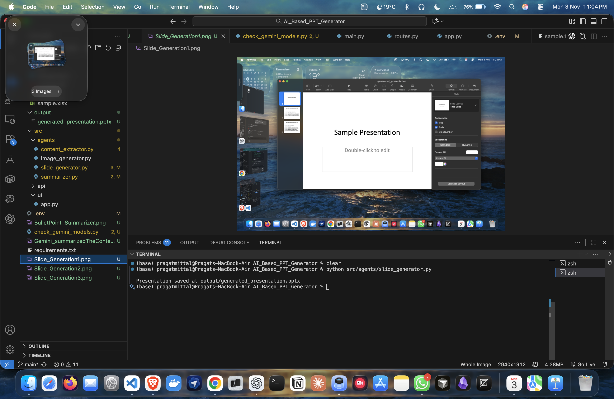
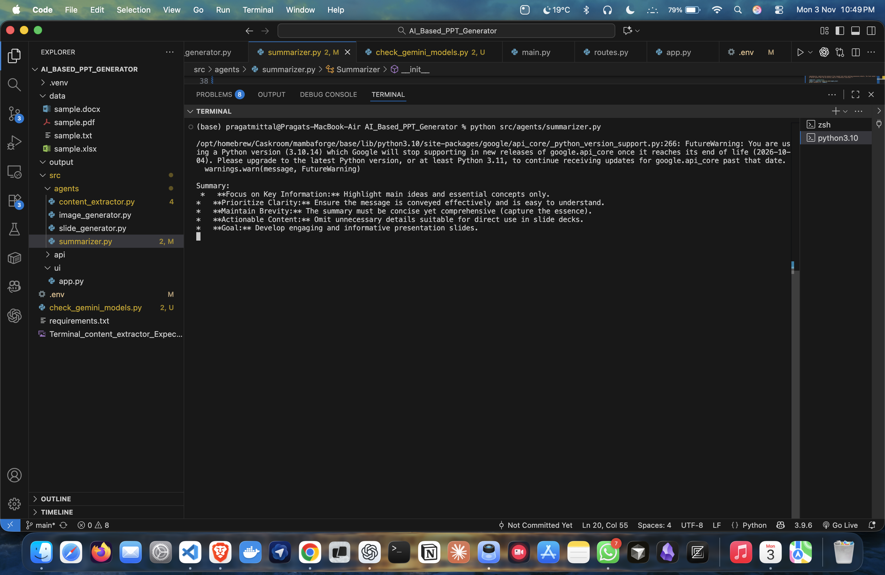

<div align="center">

# 🤖 AI-Based PPT Generator
### *Transform your text into stunning PowerPoint presentations — powered by Google Gemini AI.*


</div>

---

## 📘 Overview

The **AI-Based PPT Generator** is an intelligent automation tool that creates PowerPoint presentations from **textual content, summaries, or uploaded documents** using **Gemini AI**.  

It’s designed for **students, educators, content creators, and professionals** who want to generate clean, concise, and engaging presentations instantly — without spending hours formatting slides.

---

## ✨ Key Features

- 🧠 **AI Summarization with Gemini**
  - Automatically condenses long paragraphs into meaningful bullet points.

- 🖼️ **Automatic PPT Slide Generation**
  - Generates `.pptx` files with professional formatting and layout.

- 📄 **Supports Multiple Input Types**
  - Accepts plain text, copied content, or uploaded documents.

- 💾 **Instant Download**
  - Get your ready-made presentation in seconds.

- 🌐 **User-Friendly Interface**
  - Simple UI that allows users to input content and preview slides.

---

## 📸 Visual Previews

| AI-Generated Slides | Description |
|----------------------|--------------|
|  | AI-generated slide layout |
|  | Sample slide design |
|  | Slide transition example |
|  | Final generated PPT |
|  | Bullet point summarization result |
|  | Gemini AI summarized content |

---

## 🧩 Tech Stack

| Layer | Technology Used |
|--------|------------------|
| **Backend** | Python (Flask / FastAPI) |
| **AI Engine** | Google Gemini API |
| **PPT Generation** | `python-pptx` |
| **Document Processing** | `PyMuPDF`, `pdfminer` |
| **Environment Management** | `.env` for API keys |


---

## ⚙️ Installation & Setup

Follow these steps to set up the project locally:

### 1️⃣ Clone the repository
```bash
git clone https://github.com/pragatmittal/AI_Based_PPT_Generator.git
cd AI_Based_PPT_Generator
